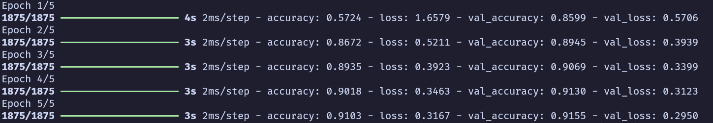
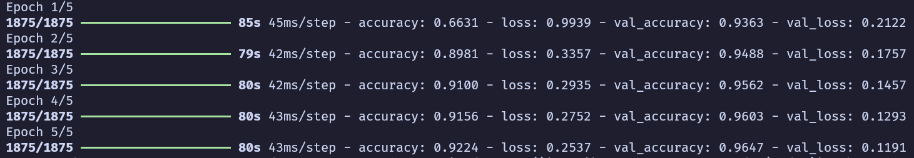

# mariana-conta-um

Aplicação de uma CNN num serviço de detecção de números usando o dataset MNIST.

O backend é implementado em Flask, e a interface de usuário é construída com Bulma e HTMX.

## Instalação

1. Clone o repositório:

   ```bash
   git clone https://github.com/Eduardo-Barreto/mariana-conta-um.git
   cd mariana-conta-um
   ```

2. Crie um ambiente virtual e instale as dependências:

   ```bash
   cd src/
   python -m venv venv
   source venv/bin/activate
   pip install -r requirements.txt
   ```

3. Execute o servidor Flask:

   ```bash
   flask run
   ```

4. Acesse a aplicação em [http://localhost:5000](http://localhost:5000).

## Como Funciona

- `/predict`: Rota que recebe uma imagem e retorna o dígito previsto.
- `/`: Rota que exibe a página HTML com o formulário para envio de uma imagem.

## Modelos

O projeto conta com 2 modelos, um MLP chamado `mlp_model` (:p) e um com CNN chamado `cnn_model` (:p), ambos na pasta src/models

Métricas do modelo MLP:


Métricas do modelo CNN:


É possível notar pelas métricas e pela demonstração que o CNN tem uma performance melhor.

## Vídeo de Demonstração

https://github.com/Eduardo-Barreto/mariana-conta-um/assets/34964398/cf2b522b-68f2-4aa9-8a68-11f4343fc513


---

creditos para luiza do nome do repositorio
